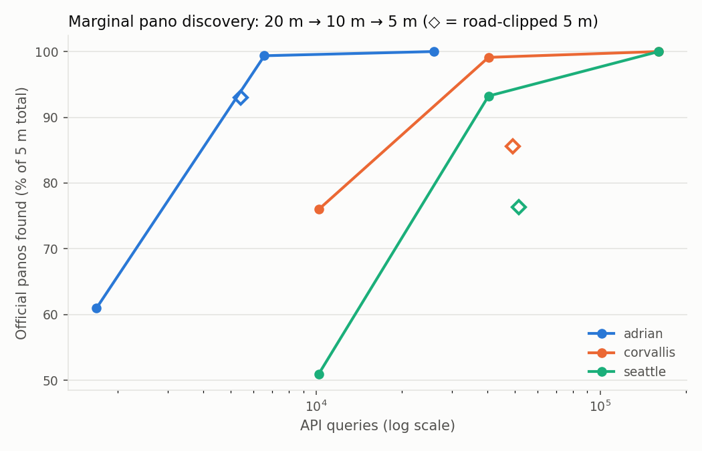
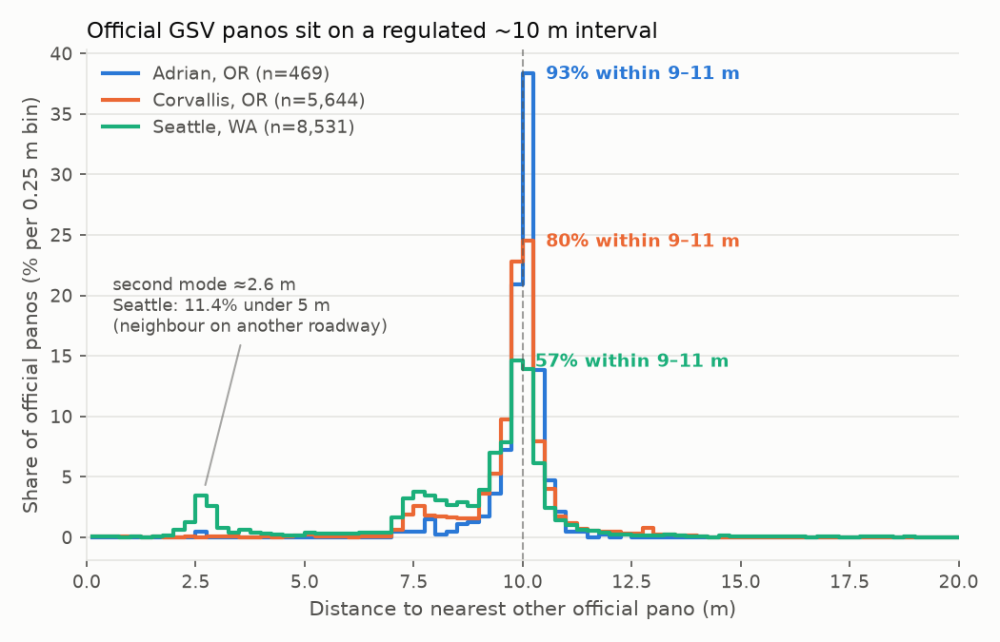
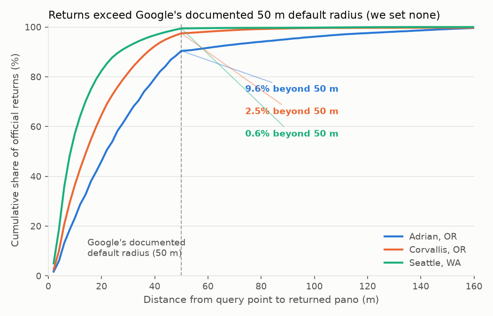
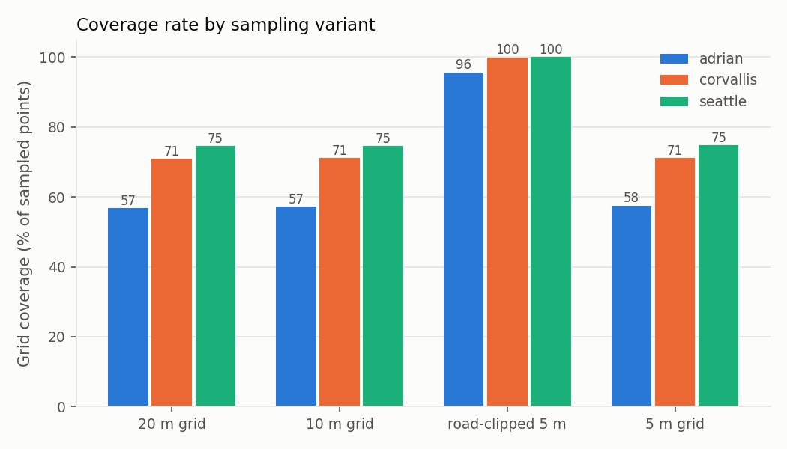
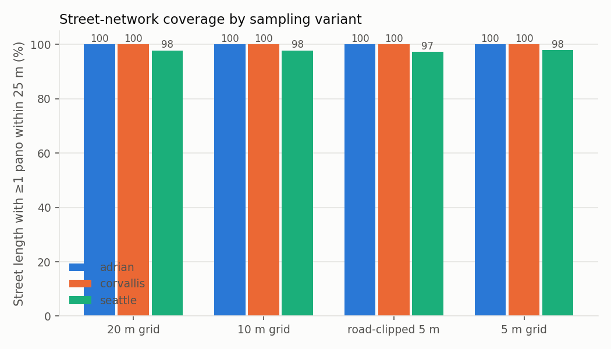

# Grid density: does sampling finer than 20 m pay?

**Issue:** [#106](https://github.com/jonfroehlich/streetscape-tracker/issues/106) (closed) ·
**Ran:** 2026-07-26 · **Verdict:** stay at 20 m; spend the query budget on road walks (#99) instead.

## The question

Every run samples a city on a frozen 20 m grid and asks GSV for the nearest pano at each
point. Densifying that grid is tempting because it is a *parameter* change, not a new
collector: frozen geometry, immutable dated CSVs, and the whole diff machinery keep
working. It would also make multi-pano / fractional-coverage evidence (#96) viable for
GSV, which today only the road walk provides.

The cost is quadratic — 20→10 m is 4× the queries, 20→5 m is 16× — so the question is
not "is finer better" but **where the marginal pano per query goes to zero**.

## Method

One aligned **5 m** GSV sweep per study area, and every coarser variant derived from that
single snapshot offline. This is the design decision that makes the experiment honest and
cheap: the 20 m, 10 m and road-clipped variants are *bit-identical index subsets* of the
5 m lattice, so variant-to-variant differences cannot come from collecting on different
days, different origins, or a moving imagery corpus.

The alignment invariant that buys this (`grid_density_common.py`): production computes each
point as `destination(destination(origin, 0°, i·step), 90°, j·step)`, and `(4i)·5.0 ==
i·20.0` exactly in floats, so the 5 m lattice point at index `(4i, 4j)` is bit-identical to
the production 20 m point at `(i, j)` — **provided the 5 m index range is derived from the
production 20 m range**. A naive `int(dim/5)` sizing silently drops the most-negative
row/column whenever `int(dim/20)` is odd. `tests/test_grid_density.py` pins this.

Three areas spanning the density regimes: **Adrian, OR** (rural, full city), **Corvallis,
OR** (college town, 2×2 km tile), **Seattle, WA** (dense urban, 2×2 km tile). Metric
semantics deliberately mirror production — coverage is `analysis.PRESENT_STATUSES` over
total points, pano counts filter to official `© Google` via `analysis.is_google_copyright`,
and per-edge street coverage uses `street_coverage.py`'s 25 m nearest-join. Collection ran
on the isolated `GMAPS_STREETS_API_KEY` / `gsv_streets` ledger, so it could not touch the
production grid quota.

## Findings

| area | transition | extra queries | new official panos | per 1k extra queries | coverage Δ |
|---|---|---|---|---|---|
| Adrian | 20 → 10 m | +4,880 | 180 | 36.9 | +0.4 pp |
| Adrian | 10 → 5 m | +19,360 | **3** | **0.2** | +0.4 pp |
| Corvallis | 20 → 10 m | +30,200 | 1,304 | 43.2 | +0.2 pp |
| Corvallis | 10 → 5 m | +120,400 | **50** | **0.4** | +0.1 pp |
| Seattle | 20 → 10 m | +30,200 | 3,604 | 119.3 | +0.1 pp |
| Seattle | 10 → 5 m | +120,400 | **577** | **4.8** | +0.1 pp |



**1. Below 10 m there is nothing left to find.** Official panos sit ~10 m apart along a
road — measured nearest-neighbour spacing p50 9.5–10.1 m in all three areas — so a 5 m
lattice mostly re-queries panos it already has. Rows per official pano climbs to 9.6
(Seattle) / 19.5 (Corvallis) / 31.8 (Adrian) at 5 m: that is the redundancy, priced.

The full distribution, from the 5 m near-census (`offset_metrics` in
`grid-density_metrics.json`), matters more than the median — **the spread is what shows the
interval is machine-regulated**, and it is the number to cite when asked how finely GSV
samples:

| area | p25 | p50 | p75 | p90 | IQR | n official panos |
|---|---|---|---|---|---|---|
| Adrian | 9.9 | 10.1 | 10.2 | 10.5 | 0.3 | 469 |
| Corvallis | 9.5 | 9.9 | 10.2 | 10.6 | 0.7 | 5,644 |
| Seattle | 7.9 | 9.5 | 10.1 | 10.4 | 2.2 | 8,531 |



**The distribution is bimodal, and the percentiles hide it.** The share landing in a ±1 m
band around 10 m is **92.5% (Adrian) / 79.6% (Corvallis) / 57.3% (Seattle)** — that band
share, not the median, is the evidence the interval is machine-regulated, since a bimodal
distribution can have the same median. The second mode sits at **≈2.6 m** and carries
**0.4% / 0.7% / 11.4%** of panos respectively.

That sub-5 m mode is where the statistic stops answering the question. Nearest-neighbour is
a *point-set* measure, not an along-track capture interval: wherever two roadways run close
together in plan view, a pano's nearest neighbour is on the *other* roadway rather than
ahead of or behind it on its own. So Seattle's 11.4% is not evidence of finer sampling
downtown, and it is why Seattle's p25 (7.9 m) drops below the regulated interval while its
p75 (10.1 m) does not. **Quote the 9–11 m band share, not the median, when the question is
how finely GSV samples.**

**Which roadways produce it is an open question — the candidate mechanisms are not
distinguished here.** At least three would produce sub-5 m neighbours, and they predict
different things:

| mechanism | predicts |
|---|---|
| a second pass on the same roadway (opposite direction, or an adjacent lane) | mass at roughly lane-width scale, concentrated on `oneway=False` edges |
| **bridges, overpasses and interchanges** | near-**zero** planar separation, since projecting to 2D collapses the vertical gap between a deck and the road beneath it; concentrated on `bridge`/`tunnel` edges |
| intersections | concentrated near nodes with `street_count` >= 3 |

The one discriminator the distance data alone supplies argues **against** vertical stacking
being the main driver: it would put mass at near-zero, and there is almost none. Seattle
has **0.19%** under 1 m, while **10.05%** sits in 2–4 m in a tight peak centred ≈2.6 m —
roughly a lane width, not a deck-over-road coincidence. That is suggestive, not a test:
roadways crossing at an angle still separate by a few metres in projection, so the
mechanisms are not cleanly separable by distance alone.

Testing it needs no new collection. The cached GraphML for these areas already retains
`bridge`, `tunnel`, `junction`, `lanes`, `oneway` and node `street_count`, so tagging each
sub-5 m pano by what it sits on is an offline join against artifacts already on disk.
Until that runs, treat the mechanism as unattributed.

GSV exposes no run/sequence identifier, so none of this can be corrected for at the pano
level; Mapillary's `sequence_id` makes the same correction trivial, which is the sharpest
methodological difference between the two providers.

**1b. Query→pano offsets do not match Google's documented default radius.** The collector
sets no `radius`, so the documented 50 m default should apply, and it describes the bulk
but not the tail:

| area | p50 | p90 | p99 |
|---|---|---|---|
| Adrian | 21.7 | 49.6 | 146.1 |
| Corvallis | 14.3 | 37.3 | 74.5 |
| Seattle | 8.3 | 26.6 | 48.1 |



Adrian's p90 sits exactly on the documented 50 m, yet **9.6% of its successful official
returns come from beyond it** (Corvallis 2.5%, Seattle 0.6%), out to 146 m at p99. The
share rises as imagery gets sparser, which is the shape you would expect if the radius
were larger than documented — or absent — rather than if a 50 m cutoff were being applied
at all. Unexplained; flag it rather than relying on the 50 m figure, and set `radius`
explicitly in any study where the search neighbourhood needs to be a known quantity.

**2. Coverage % — the headline metric — is already stable at 20 m.** Across a 16× query
increase it moves by ≤0.4 pp everywhere. Whatever a denser grid buys, it is not a
different answer to "what fraction of this city has imagery".



**3. Grid density is not what limits street attribution either.** Against the road-walk
near-census, the 20 m grid already scores recall 100% / precision 100% in Adrian and
97.3% / 99.3% in Seattle — and the 5 m grid moves recall by 0.4 pp. The ambiguity that
remains is parallel-street and intersection confusion, which is a *bearing/topology*
problem (#97, #98), not a sampling-rate problem.



**4. The real win was clipping to roads, not densifying.** A 5 m lattice restricted to
points within 15 m of an OSM edge reaches 95.6–100% coverage for roughly a *third* of the
full 5 m grid's queries — because it drops the 68–79% of lattice points that are far from
any road (inside buildings, water, parkland), where no imagery can exist. That is the quantitative
case for the road-walk modality (#99), which samples on the centerline by construction.

## Decision

Production stays on the 20 m grid. Finer grid sampling is closed as a dead end: it buys
redundancy, not information, and the coverage number it produces is the same one. The
budget that a 10 m grid would consume goes to road walks instead, where association is by
construction and coverage is fractional per edge.

## Caveats

- The derived 10 m variant can be ≤1 row/col smaller than a native `int(dim/10)` grid
  (index-subset construction).
- Corvallis and Seattle are 2×2 km tiles, so absolute street-coverage percentages are
  envelope-relative; variant-to-variant deltas are unaffected.
- Grid coverage % is deliberately not comparable across the road-clipped variant — its
  denominator contains only near-street points.
- Seattle's only production run (2024-12-19) is a pre-catalog legacy baseline collected
  from a grid origin ~4 m off the frozen center, so it shares no lattice keys with the
  experiment (or with future frozen-geometry runs; `diff.py` handles this via
  `grid_aligned=False`). Adrian and Corvallis cross-check at 100% key match / 99% same-pano
  against their production runs.

- Nearest-neighbour spacing is measured over *unique* official panos, so it understates the
  along-track capture interval wherever passes overlap (see finding 1). It is also only
  as complete as the 5 m lattice: the API returns one nearest pano per query, so the pano
  set is the image of the lattice under a nearest-neighbour map. Saturation at 10→5 m
  (finding 1) is the evidence that the residual thinning is small, not a proof of census.
- Three areas, all US, two of them 2×2 km tiles. Do not generalize the spacing figure to
  non-US GSV coverage without re-measuring.

## Replicating

```bash
python scripts/grid_density_collect.py --estimate --area all   # query counts, no key needed
python scripts/grid_density_collect.py --area all              # ~348k queries on gsv_streets
python scripts/grid_density_analyze.py --area all              # derives variants, writes report
```

Derived results are committed beside this writeup and do not require re-collection:
`grid-density_metrics.json` (per-area variants, offsets, street metrics) and
`grid-density_variants_summary.csv`. The raw 5 m collection CSVs stay in the gitignored
`/experiments/grid-density/`.

Collection needs `GMAPS_STREETS_API_KEY`; analysis is offline given the snapshots. Both
write to `experiments/grid-density/` — **gitignored, and never under `data/`**, because the
publisher rsyncs any `*.csv.gz` it finds there to the public web server. The analysis
regenerates `report.md` (the full per-area tables this document summarizes),
`variants_summary.csv`, `{area}_metrics.json`, and the three figures above.
