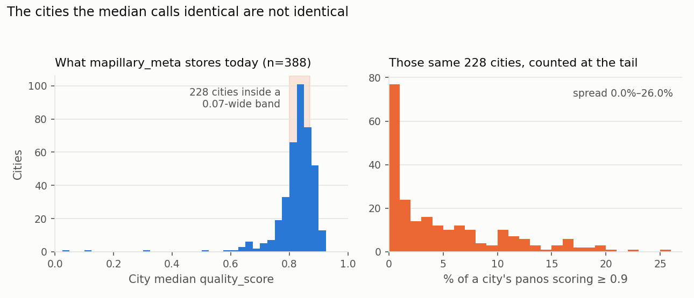
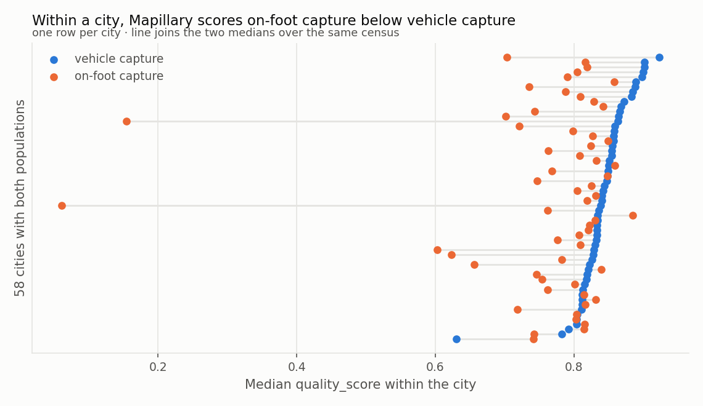

# Mapillary's per-image `quality_score`: can it rank Sidewalk candidate cities?

Mapillary is the only provider we collect that publishes a **visual-quality prediction** — `quality_score`, documented as "predicted visual quality of the image in the range [0.0, 1.0]".
GSV's metadata endpoint exposes nothing of the kind, KartaView's `nearby-photos` row carries nothing of the kind, and Panoramax's `quality:horizontal_accuracy` is *positional* accuracy, a different quantity ([`../imagery-providers.md`](../imagery-providers.md)).
It rides on the same z14 tiles the downloader already fetches, so it has cost nothing since `f4bf905` (2026-07-24) started persisting it.

We keep exactly one number from it — `mapillary_meta.median_quality_score`, one median per run — and that number reaches nothing: `_build_provider_summary` does not carry the block, so it is absent from the published `cities.json.gz` (verified: schema v3, 1,203 cities, 1,115 of them with a Mapillary block, the string `mapillary_meta` nowhere in the file), and no page in `www/` reads it.
This study asks whether that signal, surfaced, would help pick where Project Sidewalk deploys next.

**The answer is a qualified yes with one inversion that matters more than the rest.**
The statistic we currently store cannot rank cities and a tail share can; but the score runs *against* pedestrian capture, so ranking cities by quality ranks against exactly the imagery a sidewalk deployment wants.

Metrics: [`mapillary-image-quality_metrics.json`](mapillary-image-quality_metrics.json), per-city rows: [`mapillary-image-quality_cities.csv`](mapillary-image-quality_cities.csv).

## What was measured

Each city's **latest** Mapillary run — one run per city, never the whole series, or the distribution would be weighted by how often the scheduler happened to revisit a city rather than by the imagery.
Rows with `status` OK or NO_DATE only, which for Mapillary is the 360° pano census: the extra columns are written on FLAT_ONLY and ZERO_RESULTS rows too, so a share over every row would describe the grid rather than the imagery.
Each such row is one **image**, not one grid point (#289), so `n_panos` here is an image count.

Of 1,118 latest Mapillary runs on the production catalog:

| | runs | why |
|---|---|---|
| measured | **388** | carry the enriched schema and at least one scored 360° pano |
| no scored pano | 601 | the city's latest run found flats only, or nothing at all |
| pre-2026-07-24 schema | 129 | no `quality_score` column exists in the file |

That reconciles against the catalog independently: 442 of the 1,118 latest runs record any 360° pano, and 442 − 388 = 54 of those are legacy-schema runs, leaving 129 − 54 = 75 legacy runs with no panos either, and 601 + 75 = 676 = 1,118 − 442.
The legacy runs are **excluded, never zeroed** — "not measured" and "measured zero" are different findings, and folding them in would report a schema change as a collapse in imagery quality.

The measured corpus is **48,387,083 scored panos across 271,434 sequences in 388 cities**, runs dated 2026-07-23 to 2026-09-06.
It is not a uniform sample of cities: panos per city runs p25 800, p50 4,068, p75 33,043, max 15.4M, and the catalog is US- and small-city-heavy.

## Finding 1 — the median cannot rank cities; a tail share can

Across the 388 cities the stored median occupies almost no range:

| statistic (per city) | p25 | p50 | p75 | p90 | p95 | max | IQR |
|---|---|---|---|---|---|---|---|
| median `quality_score` | 0.808 | 0.837 | 0.863 | 0.885 | 0.894 | 0.918 | **0.055** |
| % of panos ≥ 0.9 | 0.0 | 2.83 | 11.55 | 26.79 | 41.83 | 99.05 | 11.55 |
| % of panos < 0.6 | 0.0 | 0.06 | 1.01 | 5.53 | 13.20 | 100.0 | 1.01 |

**228 of 388 cities (58.8%) have a median inside a single 0.07-wide band, 0.80–0.87.**
That is not the median reporting that those cities are alike.
Taking only those 228 cities — the ones the published statistic calls interchangeable — and counting the *same images* at the tail spreads them from **0.0% to 26.0%** ≥ 0.9 (p25 0.28, p50 2.93, p75 7.52, p90 12.90).



This is [`pano-spacing.md`](pano-spacing.md)'s lesson in a different guise and [`grid-density.md`](grid-density.md)'s stated outright: a percentile spread hides a shape, and here the shape is the whole signal.
The median is the statistic a 0–1 bounded score is *least* informative at, because the mass sits there for every city.

## Finding 2 — most cities are a handful of drives, and the weighting bites exactly there

A `sequence_id` is one contributor's drive, so its images are one camera sampled every few metres rather than thousands of independent observations.
The catalog's cities are mostly very few drives: **sequences per city p25 4, p50 18**, p75 157 — 113 of 388 cities are four drives or fewer, and 203 are twenty or fewer — at a median 228 images per sequence.

Weighting by drive instead of by image changes the median city not at all (`image − sequence` delta p50 **0.000**, p25 −0.005, p75 +0.002) and Spearman between the two rankings is 0.890.
But the extremes are severe — delta min −0.201, max +0.197 — and rank displacement runs p50 9 places, p90 62, **max 363 of 388**:

| city | images | drives | image-weighted p50 | drive-weighted p50 | rank moves |
|---|---|---|---|---|---|
| Glendora, CA | 6,142 | 9 | 0.916 | 0.719 | 363 |
| Longview, WA | 3,318 | 4 | 0.871 | 0.677 | 298 |
| Malden, MA | 1,422 | 51 | 0.804 | 0.893 | 279 |

Glendora reads as one of the best cities in the catalog on the image-weighted median and as a mediocre one on the drive-weighted median, because one good drive supplied most of its images.
So the two weightings agree about the typical city and disagree about precisely the cities a shortlist would surface.
**Publish the drive count beside any quality statistic**; a city's quality "distribution" is often four observations wearing thousands of hats.

A prerequisite of every per-class number below, measured rather than assumed: across all **271,434 sequences, zero** carry more than one value of `on_foot`, and **zero** carry more than one `organization_id`.
Both are drive-level properties in Mapillary's data, so assigning a class to a drive is exact here rather than a majority vote.

## Finding 3 — the score runs against pedestrian capture

This is the finding that decides how the signal may be used.

Pedestrian capture is rare in our catalog to begin with: only **121 of 388 cities** hold any on-foot imagery at all, and the on-foot share is p50 0.0%, p75 0.04%, p90 9.2%, p95 43.5%.

Within a city, comparing the two populations over the same census — a paired design, so it cannot be explained by *which* cities have pedestrian capture — Mapillary scores on-foot imagery **below** vehicle imagery almost everywhere.
58 cities qualify (both sides ≥ 100 scored panos across ≥ 3 distinct drives; on-foot side p50 15 drives, vehicle side p50 187):

| weighting | median delta | p25 | min | cities scoring on-foot lower |
|---|---|---|---|---|
| image-weighted | −0.042 | −0.093 | −0.777 | 48 / 58 (**82.8%**) |
| drive-weighted | −0.043 | −0.101 | −0.536 | 49 / 58 (**84.5%**) |

Both weightings agree, which is what makes this robust rather than an artifact of one long walk.
The extremes are drastic: Yogyakarta's on-foot median is **0.061** against 0.838 for its vehicle imagery (9 drives vs 152), Lima's is 0.154 against 0.863, Carefree AZ's 0.603 against 0.829.
Only three cities run the other way, none by more than +0.111 (Nanaimo).



**The cross-city view finds almost none of this**: Spearman between a city's on-foot share and its median quality is only **−0.106**.
That gap between −0.106 across cities and 84.5% within them is the methodological point.
A scatter of city-level aggregates is confounded by everything else that differs between cities; the paired comparison is not, and it is the paired comparison that finds the effect.

The operational consequence is an inversion.
Pedestrian-level imagery is often *what a sidewalk assessment wants* — it sees the sidewalk, not the roadway from a car roof — and it is the population Mapillary's predictor marks down hardest.
So `quality_score` is a usable proxy for "will a labeller see a clean image", and it is **not** a proxy for "is this city's imagery useful for Project Sidewalk".
Ranking candidate cities on it alone would systematically deprioritize pedestrian-captured cities.
Any surfacing of this signal has to carry the on-foot share beside it.

## Finding 4 — organizational capture does not predict quality (negative result)

`mapillary_meta` already carries `pct_with_org`, and the obvious reading — an organization means a fleet means a good camera — is a hypothesis, so it was tested the same paired way over 98 qualifying cities.

It is a clean null.
Drive-weighted, the org-minus-individual median delta is **exactly 0.000** and organizations score higher in **exactly 49 of 98 cities (50.0%)**; image-weighted it is +0.003 and 53.1%.
The cross-city Spearman is +0.199, weak and in the plausible direction, but the paired test says the association is not a within-city quality difference.

Organizational capture is still worth surfacing — it says something about *systematic* coverage, which is a different question — but not as a quality proxy.

## What this does not establish

- `quality_score` is **a vendor's prediction, not ground truth**, and nothing here validates it against labelling usefulness. We measured what Mapillary says, not whether Mapillary is right. The on-foot penalty is equally consistent with "handheld pedestrian imagery really is blurrier" and with "the predictor was trained on vehicle imagery"; distinguishing them needs labelled data we do not have.
- 360° panos only. Flats are excluded throughout, and they are a large share of Mapillary's corpus.
- The on-foot classes are **Mapillary's own `foot` flag**, not an independent determination.
- The population is our catalog, which is US- and small-city-heavy; the tail-share distribution in particular would move under a different city set.
- 601 of 1,118 cities have no 360° imagery to score at all, so for most of the catalog this signal does not exist regardless of how it is published.

## What it decides

1. **Publish the distribution, not the median** — percentiles plus the tail shares. The median is the one summary that provably cannot rank.
2. **Carry the drive count with it.** A city that is four drives is four observations.
3. **Never rank on quality alone.** Pair it with the on-foot share, or a quality ranking silently ranks against sidewalk-relevant imagery.
4. Everything above is computable from censuses already on disk; none of it needs a re-collection.

## How to replicate

The collection half runs where the run CSVs are (production) and reduces each census to one row; the analysis half never touches a census.

```bash
# on the host holding the catalog and run CSVs (~1 h, bounded ~450 MB, safe beside the nightly batch)
python scripts/mapillary_image_quality_collect.py \
    --out-dir experiments/mapillary-image-quality --catalog-label makelab2-prod

# anywhere, from the per-city rows
python scripts/mapillary_image_quality_analyze.py \
    --cities-csv experiments/mapillary-image-quality/city_quality.csv \
    --docs-dir docs/experiments --catalog-label makelab2-prod
```

`--catalog-label` is recorded in the metrics file and is not optional in spirit: which catalog was read is not recoverable from the numbers afterwards, and a dev laptop holds three Mapillary runs against production's 1,118 — the same trap [`undated-imagery-share.md`](undated-imagery-share.md) nearly shipped a reversed conclusion on.

The committed per-city CSV carries the collector's **whole** row, so `mapillary_image_quality_analyze.py` regenerates every number in the metrics file from it without re-reading a single census.
`tests/test_mapillary_image_quality.py` pins the denominators, the two weightings, the paired filter, and the agreement between the collector's percentiles and `scripts/experiment_stats.percentile`.
