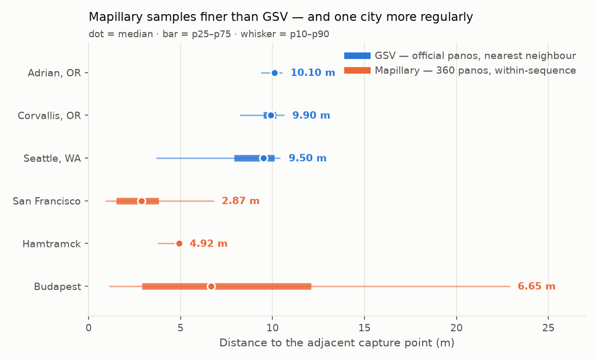
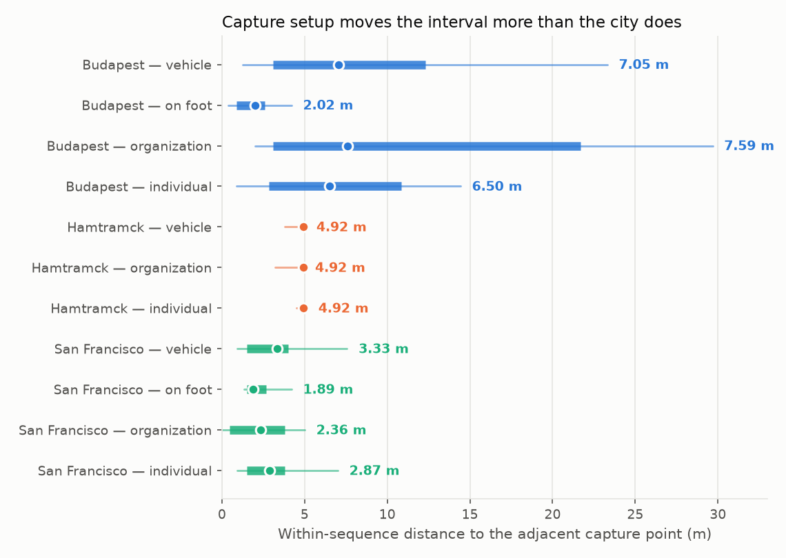
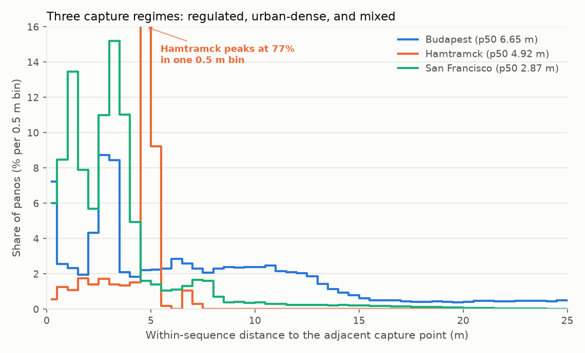
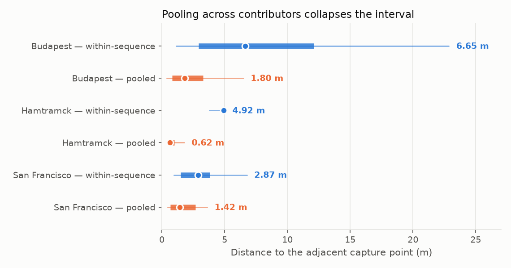

# Capture spacing: how finely do GSV and Mapillary sample a street?

**Ran:** 2026-08-17 ·
**Verdict:** Mapillary samples 1.4–3.5× finer than GSV, but "Mapillary" is not one thing —
capture setup moves the interval more than the city does.

## The question

GSV imagery looks like it sits on a fixed interval; Mapillary is crowd-collected, so its
spacing presumably depends on each contributor's rig. How far apart *are* consecutive
capture points, for each provider, with real numbers and real error bars?

This is a property of the providers, not of our sampling lattice. The neighbouring
question — what grid step *we* should collect on — is settled separately in
[`grid-density.md`](grid-density.md) (#106), whose GSV measurement this study reuses as its
GSV arm.

## Method, and the one decision everything rests on

**The obvious estimator is wrong for Mapillary, and badly.** Nearest-neighbour over the
pooled pano set does not measure a capture interval when many contributors drive the same
popular streets: the nearest image is usually from *someone else's drive*. Pooled NN
therefore measures how many people drove a road, and returns a spuriously small number
that reads as "Mapillary samples 16× finer than GSV".

The correct estimator is **within-sequence** — `sequence_id` identifies one capture drive,
so the distance to the adjacent capture point can be taken along that drive alone.

**This inverts the two providers' apparent reliability, which is the study's main
methodological finding.** GSV looks like the rigorous source and Mapillary like the messy
crowd one. But **GSV publishes no drive or run identifier at all**, so the same correction
is impossible there and its number is stuck with whatever contamination it carries — which
#106 measured as a second mode at ≈2.6 m holding 11.4% of Seattle's panos (mechanism still
unattributed; [#223](https://github.com/jonfroehlich/streetscape-tracker/issues/223)).
Mapillary's number can be corrected. Mapillary's is the better-founded figure.

We compute both and publish both, the pooled one **not as a metric but as the measured size
of the error it would introduce**.

Three cities, chosen as the largest post-2026-07-23 Mapillary censuses spanning different
capture cultures: **San Francisco** (500k panos), **Budapest** (872k), **Hamtramck, MI**
(301k). Runs before 2026-07-23 carry no `sequence_id` and the analyzer refuses them rather
than silently falling back to the pooled estimator.

## Findings

| provider · city | p25 | **p50** | p75 | p90 | IQR | n panos |
|---|---|---|---|---|---|---|
| GSV · Adrian, OR | 9.90 | **10.10** | 10.20 | 10.50 | 0.30 | 469 |
| GSV · Corvallis, OR | 9.50 | **9.90** | 10.20 | 10.60 | 0.70 | 5,644 |
| GSV · Seattle, WA | 7.90 | **9.50** | 10.10 | 10.40 | 2.20 | 8,531 |
| Mapillary · San Francisco | 1.49 | **2.87** | 3.81 | 6.76 | 2.32 | 499,572 |
| Mapillary · Hamtramck, MI | 4.77 | **4.92** | 4.93 | 5.02 | **0.16** | 300,980 |
| Mapillary · Budapest | 2.91 | **6.65** | 12.10 | 22.85 | 9.19 | 871,609 |



**1. Mapillary samples finer than GSV, by 1.4–3.5×.** Median spacing is 2.87–6.65 m against
GSV's 9.5–10.1 m. This is the headline answer, and it is the opposite of what "professional
fleet vs. crowd" intuition predicts.

**2. "More regular than GSV" is achievable, and one city achieves it.** Hamtramck's IQR is
**0.16 m** — half of Adrian's 0.30 m, the tightest GSV area. Its distribution is a single
spike: 77% of panos fall in one 0.5 m bin at 4.9 m, 0.01% exceed 20 m. That is a systematic
fleet capture running a distance trigger at a 5 m target, and it shows the crowd platform
is not inherently irregular — it is *heterogeneous*.

**3. The heterogeneity is the real finding, and it is between capture setups, not cities.**



| stratum | Budapest | San Francisco |
|---|---|---|
| vehicle | 7.05 m | 3.33 m |
| **on foot** | **2.02 m** | **1.89 m** |
| organization | 7.59 m | 2.36 m |
| individual | 6.50 m | 2.87 m |

Pedestrian capture is **3.5× denser than vehicle capture in the same city** (Budapest), a
larger gap than the 2.1× between the two cities' vehicle medians. The expectation that
Mapillary spacing depends on the contributor's setup is confirmed, with the refinement
that *mode of travel* dominates and organization-vs-individual barely matters (Hamtramck's
two strata differ by 0.03 m; both are the same program).

**4. Three distinct capture regimes are visible in the shape.**



- **Hamtramck — regulated.** One spike, nothing else.
- **San Francisco — urban-dense.** Mass at 1.5–4 m, 26% of panos captured on foot.
- **Budapest — mixed.** A broad 5–15 m hump *plus* **12.6% beyond 20 m** (highway capture,
  where Mapillary's smart spacing targets 20 m) *plus* a stationary spike: **7.2% of
  consecutive captures are within one tile-quantization unit of each other**, i.e. the
  camera did not move. That is the signature of a **time-triggered** device idling at a
  light, coexisting in the same corpus with distance-triggered ones. San Francisco shows
  6.0%; Hamtramck's fleet, 0.55%.

**5. Pooling costs a factor of 2–8, measured.**



| city | within-sequence p50 | pooled p50 | error |
|---|---|---|---|
| Hamtramck | 4.92 m | 0.62 m | **7.9×** |
| Budapest | 6.65 m | 1.80 m | 3.7× |
| San Francisco | 2.87 m | 1.42 m | 2.0× |

Hamtramck's pooled figure, 0.62 m, is close to the tile quantization floor (0.44 m) — the
pooled estimator has stopped measuring imagery at all and is measuring how many times the
fleet re-drove each street. **Any spacing number computed without grouping by sequence
should be discarded.**

## What the providers document

Consistent with the measurements, and worth quoting because it explains the shape rather
than just confirming the number:

- Mapillary's **smart spacing is distance-triggered from GPS**, targeting **3 m in cities**
  and **20 m on highways** (≥50 km/h) — [forum](https://forum.mapillary.com/t/new-smart-spacing/7318).
  Budapest's bimodal hump-plus-tail is exactly this.
- Mapillary staff put the computer-vision ideal at **"about 5 m between the images"** —
  [forum](https://forum.mapillary.com/t/what-is-the-best-distance-between-uploaded-photos/922).
  Hamtramck's fleet runs 4.92 m.
- Video upload extracts **one frame per 3 m** by default; `mapillary_tools` splits a
  sequence when consecutive images exceed **100 m or 120 s** — [mapillary_tools](https://github.com/mapillary/mapillary_tools).
  The 100 m rule truncates the far tail of our distribution by construction.
- Users report the distance trigger failing badly in practice — **50–130 m gaps** at
  highway speed from GPS error and Android scheduling delays. Budapest's 12.6% beyond 20 m
  is partly this, not only the 20 m highway target.
- **Google documents no capture interval at all.** The ~10 m figure is ours, measured.

## Implications

1. **For coverage comparisons:** Mapillary's finer spacing does *not* mean better coverage.
   Coverage is measured on the grid and is a separate question — Budapest's 872k panos give
   **5.5%** grid coverage while Hamtramck's 301k give **47.6%**. Dense sampling of a few
   corridors is not broad coverage, and the census magnitude tells you nothing about which.
2. **For any per-pano analysis:** group by `sequence_id` first. This applies beyond spacing
   to anything that treats panos as independent samples.
3. **For quoting GSV's interval:** use the 9–11 m band share from `grid-density.md`, not the
   median, and note that GSV's figure cannot be sequence-corrected.

## Caveats

- **Nearest-neighbour, not ordered along-track gaps.** The published CSV carries
  `capture_date` at day resolution, so images within a sequence cannot be time-ordered. For
  a linear track NN is min(gap-before, gap-after) and therefore a mild **underestimate** of
  the mean gap — so the true Mapillary intervals are slightly *larger* than reported, and
  the GSV comparison is if anything conservative. Ordered gaps need `captured_at` in
  milliseconds, which the tile census holds in memory but does not write to the CSV.
- **The measurement floor is ~0.40–0.47 m**, the ground size of one z14 tile-coordinate
  unit at these latitudes. Histograms are binned at 0.5 m to stay above it; a finer bin
  renders the tile lattice as a comb of alternating full and empty bins and reads as
  spurious multi-modality. Residual fine structure below ~2 m should not be
  over-interpreted. Re-check `quantization_m` before analysing a city nearer the equator.
- **"Stationary" is inferred, not observed.** A sub-quantization pair is consistent with a
  stopped time-triggered camera, but also with two genuinely-nearby images collapsing onto
  one tile coordinate. The 7.2% figure is far above what collapse alone would produce at a
  6.65 m median, but it is not a direct observation of a stopped vehicle.
- **Three cities, one run each**, chosen by pano count rather than sampled. Hamtramck in
  particular is a single fleet program and should not be read as representative of US
  Mapillary coverage.
- **GSV and Mapillary are measured in different cities.** No city has both a 5 m GSV sweep
  and a large Mapillary census. The provider gap is large (1.4–3.5×) relative to the
  city-to-city variation within each provider, but a matched-city comparison would be
  stronger.
- The GSV arm carries #106's own caveats, including the unattributed sub-5 m mode (#223).

## Replicating

```bash
# Census CSVs come from prod; any run from 2026-07-23 carries the extras columns.
rsync makelab2:'~/streetscape-tracker/data/CITY_*_mapillary_DATE.csv.gz' experiments/pano-spacing/
python scripts/pano_spacing_analyze.py                    # metrics per city + combined
python scripts/pano_spacing_analyze.py --figures-from-metrics docs/experiments/pano-spacing_metrics.json
```

No API calls: this reads census artifacts already collected by the nightly scheduler, so it
is clear of the per-IP constraints in #208/#209. Derived numbers are committed as
`pano-spacing_metrics.json` (percentiles, strata and 0.5 m histograms, so the figures
regenerate from git alone); the census CSVs stay in the gitignored `experiments/pano-spacing/`
and are **never** placed under `data/`, which the publisher rsyncs to the public web server.

## Open

- **Ordered along-track gaps** need `captured_at` in ms, which requires a fresh tile fetch
  rather than the published CSV. Per CLAUDE.md's top-of-file rule, that fetch is gated on
  reading Mapillary's API docs and forum first — begun above — and must run from a host
  with nothing else riding on it, never makelab2.
- **A matched-city comparison** — a 5 m GSV sweep in a Mapillary-dense city — would cost
  `gsv_streets` quota and remove the cross-city caveat.
- Whether `quality_score` or `compass_angle` predict spacing; neither is used here.
